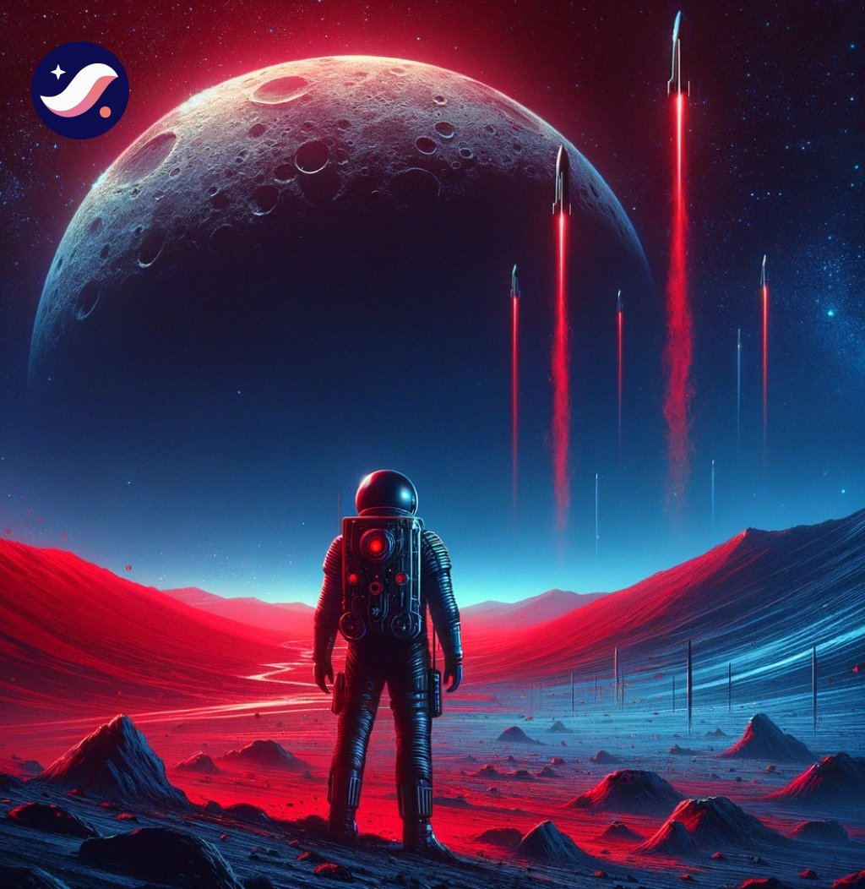
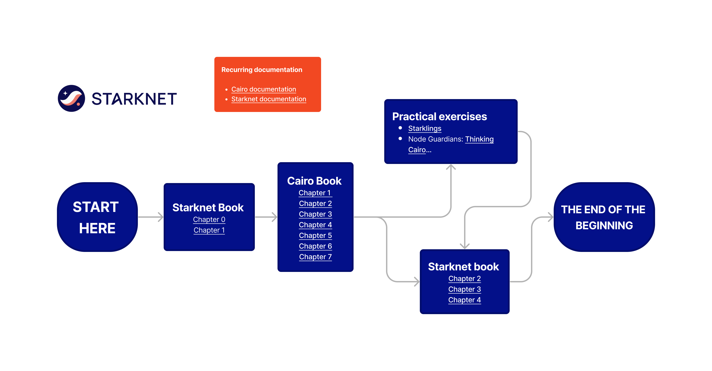

# Welcome to the Starknet Ecosystem Guide

**Right Place, Right Time.** The opportunity to build is immense. Brace for an exciting journey ahead! We're here to listen. Share your needs, and let's maximize this adventure together!

## Introduction to Starknet

Starknet is a decentralized Layer-2 network that boosts Ethereum's efficiency with faster, cheaper, and more secure transactions using zk-STARKs technology. Positioned as an enhancing layer atop Ethereum, it focuses on speed and cost, bridging scalability with widespread consensus. Starknet employs a mathematical framework to ensure network integrity, utilizing succinct, transparent proofs of computational integrity. This method allows for expanded capacity while making it possible for anyone to verify the network's integrity using accessible tools.

### Starknet’s Mission and Values

**Starknet’s mission** is to empower individuals to freely implement and use any social function they desire, underpinning a commitment to innovation, freedom, and autonomy within the digital space.

**Starknet’s values**, as outlined by Eli Ben-Sasson, Bareli, Brandt, Volokh in 2023, are deeply rooted in principles of lasting broadness, neutrality, and individual empowerment:

- **Lasting Broadness:** Starknet continuously works against power consolidation, emphasizing broad power distribution, open and transparent protocol and governance, and an inclusive governance structure that evolves to ensure long-term inclusivity.
- **Neutrality:** Starknet remains impartial, supporting a wide array of societal functions without bias towards the nature or purpose of the transactions it facilitates.
- **Individual Empowerment:** The network thrives on fostering an informed and autonomous user base, emphasizing the importance of education and community engagement as core to its mission and values.

For more detailed insights into Starknet's philosophy and technical underpinnings, refer to the [Starknet Book](https://book.starknet.io/ch00-00-introduction.html).

## Stay Updated on Starknet

To stay informed about the latest developments and opportunities within the Starknet ecosystem, follow these key Twitter accounts:

- [@Starknet](https://twitter.com/Starknet)
- [@StarkWareLtd](https://twitter.com/StarkWareLtd)
- [@GuthL](https://twitter.com/GuthL)
- [@dimahledba](https://twitter.com/dimahledba)
- [@henrlihenrli](https://twitter.com/henrlihenrli)
- [@EliBenSasson](https://twitter.com/EliBenSasson)
- [@espejelomar](https://twitter.com/espejelomar)
- [@barretodavid](https://twitter.com/barretodavid)
- @gyanlakshmi
- @man_bun_mit
- @robertkp13

With time, consider following more niche accounts within the ecosystem to tailor the information stream to your interests.

## Engaging with the Community and Building on Starknet

### Developer Support
For developers with questions about building on Starknet, join the [Starknet Discord](https://discord.com/invite/qypnmzkhbc) and explore:

- **BUIDLERS Section**: For general developer inquiries.
- **BUILDERS INPUT Section**: For specific questions about tooling in Starknet.

### Community Support
For non-developers, the **COMMUNITY SUPPORT** channels on Discord are your go-to for general assistance and inquiries.

### Meetups
If you're interested in organizing or attending a Starknet meetup, visit this page: XXX.

### Contributing to Open Source
The Starknet ecosystem is built on a strong foundation of open-source projects. Here's how you can contribute XXX:

- **Join the community on Only Dust** and start contributing to Open Source projects.
- Tackle first-time issues to get started.
- Build your portfolio while connecting with other builders.
- Develop and use cutting-edge tools before they hit the mainstream.
- Earn USDC or STRK tokens for your contributions.

### Learning Resources

#### Starknet Basecamp
Aspiring programmers can join the **Starknet Basecamp**, a 6-week bootcamp designed to kickstart your journey into the Starknet ecosystem.

- **English cohorts** start every 4-6 months.
- It's entirely online, open-source, and free.
- Access recordings online through this link XXX

#### Starknet Book and Cairo Book
If you're starting from zero, consider the following path (see image below):

1. Follow the Starknet Book and the Cairo Book for foundational knowledge.
2. Test your skills with **Starklings** and **Node Guardians** workshops.

#### Starknet Community Calls

Join the Starknet community calls to stay updated on the latest developments and engage with the community. Join Here XXX

### Documentation

XXX

